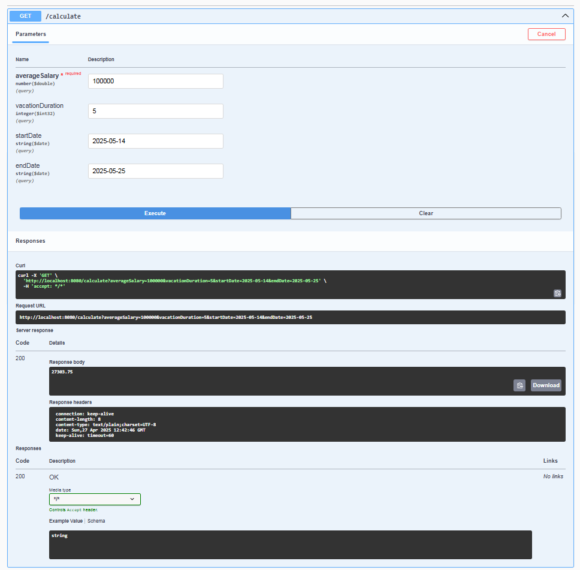

# Микросервис для расчета отпускных

Микросервис написан на Java и предоставляет REST API для расчета отпускных выплат на основе переданных параметров.

## Функционал

- Расчет отпускных по средней зарплате и количеству дней отпуска
- Учет выходных и праздничных дней при расчете (если указаны даты отпуска)
- Валидация входных параметров
- Глобальная обработка ошибок через `@ControllerAdvice`
- Логирование запросов и ошибок
- Юнит-тесты
- Документация API через Swagger

## Технологии

- Java 17
- Spring Boot
- Spring Web
- Swagger (OpenAPI 3.0)
- JUnit 5
- Logback

## API Endpoints

### GET /calculate

Расчет суммы отпускных выплат.

**Параметры:**
- `averageSalary` (обязательный) - средняя зарплата за 12 месяцев
- `vacationDuration` - количество дней отпуска (если не указаны даты отпуска)
- `startDate` - дата начала отпуска (формат: `yyyy-MM-dd`)
- `endDate` - дата окончания отпуска (формат: `yyyy-MM-dd`)

**Примеры запросов:**
1. Расчет по количеству дней:

   GET /calculate?averageSalary=100000&vacationDays=14

2. Расчет по датам (с учетом выходных и праздников):

   GET /calculate?averageSalary=100000&startDate=2024-07-01&endDate=2024-07-14

После запуска приложение будет доступно по адресу: `http://localhost:8080`

## Документация API

Документация API доступна через Swagger UI после запуска приложения:
`http://localhost:8080/swagger-ui.html`

## Логирование

Логи приложения записываются в файл `logs/application.log` с ротацией по дате и размеру.

## Обработка ошибок

Микросервис обрабатывает следующие ошибки:
- Невалидные параметры запроса
- Отсутствие обязательных параметров
- Некорректные даты
- Некорректные диапазоны дат
- Проверяет корректные запросы